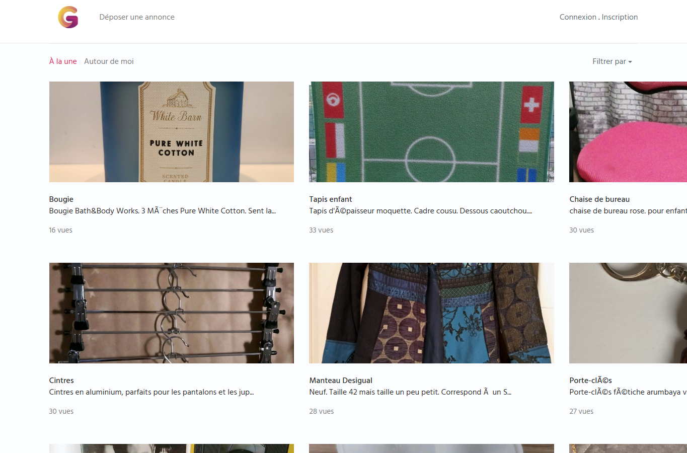
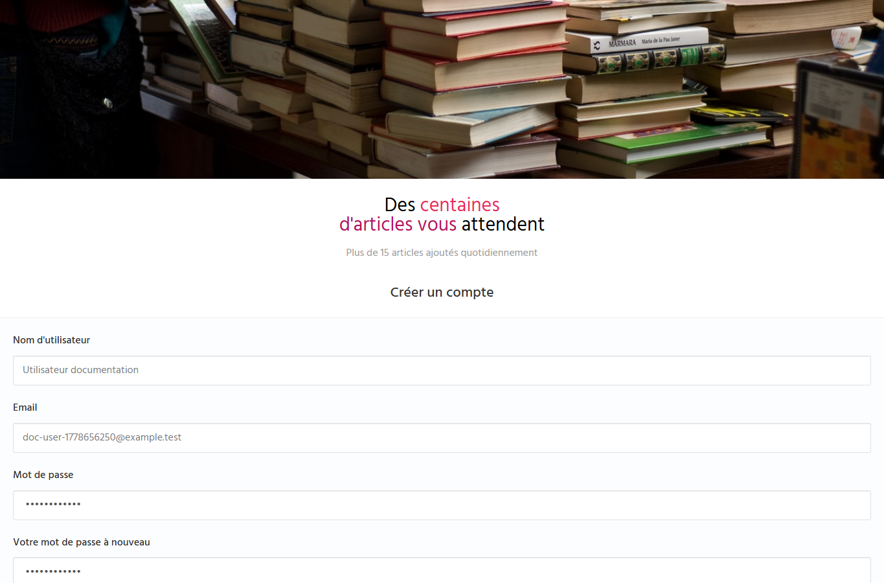
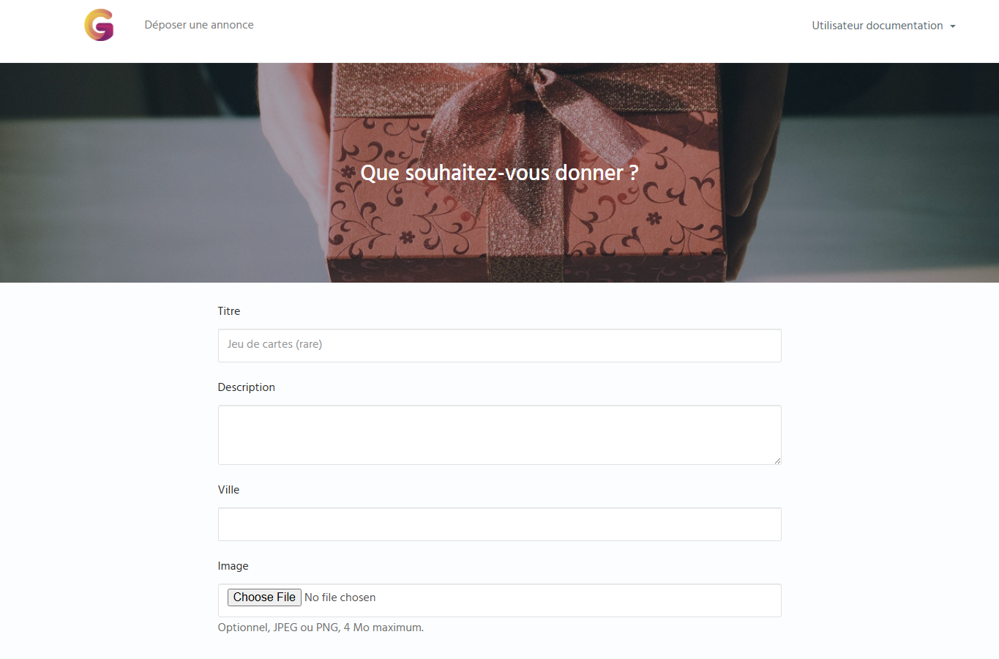
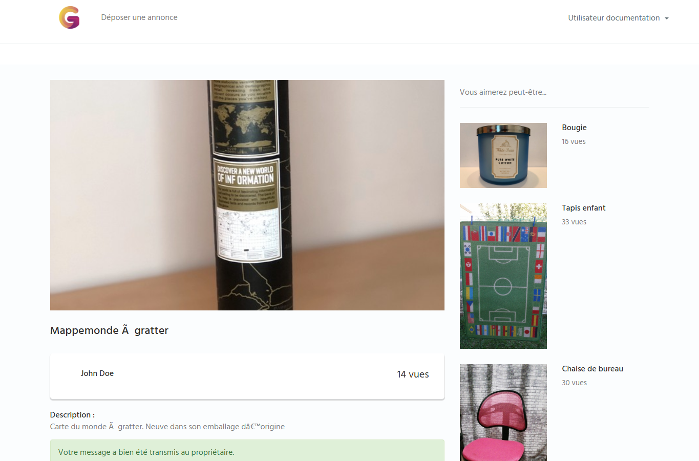

# Guide utilisateur - Vide Grenier En Ligne

## 1. Acceder au site

Ouvrir l'adresse de l'environnement:

- Developpement: `http://localhost:8080`
- Recette: `http://localhost:8081`
- Production: `http://localhost:8082`

La page d'accueil presente les annonces disponibles.

## 2. Creer un compte

1. Cliquer sur `Inscription`.
2. Renseigner le nom d'utilisateur.
3. Renseigner l'adresse email.
4. Renseigner le mot de passe deux fois.
5. Cliquer sur `Valider`.

Resultat attendu: l'utilisateur est connecte automatiquement et arrive sur la page `Mon compte`.

## 3. Se connecter

1. Cliquer sur `Connexion`.
2. Saisir l'email et le mot de passe.
3. Cocher `Se souvenir de moi` uniquement sur un poste personnel.
4. Cliquer sur `Connexion`.

Resultat attendu: l'utilisateur est redirige vers `Mon compte`.

## 4. Deposer une annonce

1. Etre connecte.
2. Cliquer sur `Deposer une annonce`.
3. Saisir un titre.
4. Saisir une description.
5. Saisir une ville si besoin.
6. Ajouter une image JPEG ou PNG si disponible.
7. Cliquer sur `Valider`.

L'image est optionnelle. Si aucune image n'est envoyee, le site affiche une image par defaut.

## 5. Contacter un proprietaire

1. Ouvrir une fiche produit.
2. Remplir le formulaire `Contacter`.
3. Saisir son nom, son email et le message.
4. Cliquer sur `Envoyer`.

Resultat attendu: la fiche produit reste ouverte et un message de confirmation apparait.
Le navigateur n'ouvre plus la messagerie locale.

## 6. Se deconnecter

1. Ouvrir le menu utilisateur.
2. Cliquer sur `Deconnexion`.

Resultat attendu: l'utilisateur revient a l'accueil et les pages protegees redirigent vers la connexion.
